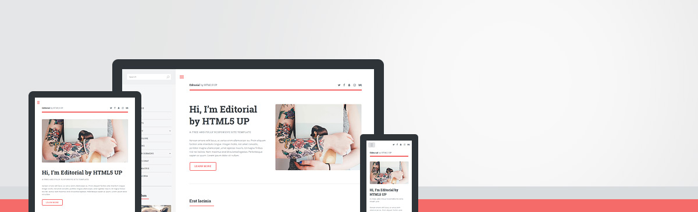

# (WIP) Editorial - Jekyll Theme

A Jekyll version of the "Editorial" theme by [HTML5 UP](https://html5up.net/).



# How to Use

For those unfamiliar with how Jekyll works, check out [https://jekyllrb.com/](https://jekyllrb.com/) for all the details,
or read up on just the basics of [front matter](https://jekyllrb.com/docs/frontmatter/), [writing posts](https://jekyllrb.com/docs/posts/),
and [creating pages](https://jekyllrb.com/docs/pages/).

- **GitLab**: Simply fork this repository and start editing the `_config.yml` file!
- **GitHub**: Fork this reposity and create a branch named `gh-pages`, then start editing the `_config.yml` file! The `.gitlab-ci.yml` file is only needed for GitLab Pages, so feel free to delete this if you are using GitHub instead.

# Added Features

* Add your **social profiles** easily in `_config.yml`.

# Configuration

You can use the following custom parameters in `_config.yml`.

## Site
- `subtitle` sets the text for the lighter colored text next to your site's title.

## Social
- `500px_url`
- `facebook_url`
- `github_url`
- `gitlab_url`
- `googleplus_url`
- `instagram_url`
- `linkedin_url`
- `pinterest_url`
- `slack_url`
- `twitter_url`

# Credits

Original README from HTML5 UP:

```
Editorial by HTML5 UP
html5up.net | @ajlkn
Free for personal and commercial use under the CCA 3.0 license (html5up.net/license)


Say hello to Editorial, a blog/magazine-ish template built around a toggleable "locking"
sidebar (scroll down to see what I mean) and an accordion-style menu. Not the usual landing
page/portfolio affair you'd expect to see at HTML5 UP, but I figured for my 41st (!!!)
template I'd change it up a little. Enjoy :)

Demo images* courtesy of Unsplash, a radtastic collection of CC0 (public domain) images
you can use for pretty much whatever.

(* = not included)

AJ
aj@lkn.io | @ajlkn


Credits:

	Demo Images:
		Unsplash (unsplash.com)

	Icons:
		Font Awesome (fortawesome.github.com/Font-Awesome)

	Other:
		jQuery (jquery.com)
		html5shiv.js (@afarkas @jdalton @jon_neal @rem)
		Misc. Sass functions (@HugoGiraudel)
		Respond.js (j.mp/respondjs)
		Skel (skel.io)
```

Repository [Jekyll logo](https://github.com/jekyll/brand) icon licensed under a [Creative Commons Attribution 4.0 International License](http://choosealicense.com/licenses/cc-by-4.0/).
